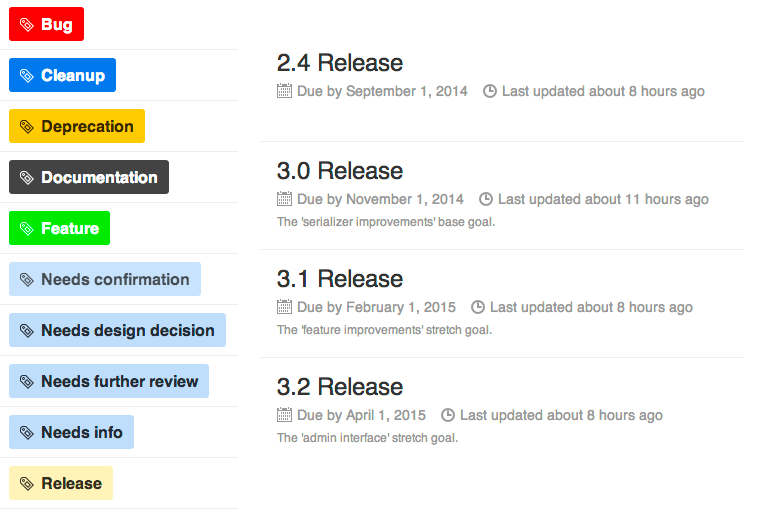

# REST framework 2.4 announcement

The 2.4 release is largely an intermediate step, tying up some outstanding issues prior to the 3.x series.

## Version requirements

Support for Django 1.3 has been dropped.
The lowest supported version of Django is now 1.4.2.

The current plan is for REST framework to remain in lockstep with [Django's long-term support policy][lts-releases].

## Django 1.7 support

The optional authtoken application now includes support for *both* Django 1.7 schema migrations, *and* for old-style `south` migrations.

**If you are using authtoken, and you want to continue using `south`, you must upgrade your `south` package to version 1.0.**

## Updated test runner

We now have a new test runner for developing against the project,, that uses the excellent [py.test](http://pytest.org) library.

To use it make sure you have first installed the test requirements.

    pip install -r requirements-test.txt

Then run the `runtests.py` script.

    ./runtests.py

The new test runner also includes [flake8](https://flake8.readthedocs.org) code linting, which should help keep our coding style consistent.

#### Test runner flags

Run using a more concise output style.

    ./runtests -q

Run the tests using a more concise output style, no coverage, no flake8.

    ./runtests --fast

Don't run the flake8 code linting.

    ./runtests --nolint

Only run the flake8 code linting, don't run the tests.

    ./runtests --lintonly

Run the tests for a given test case.

    ./runtests MyTestCase

Run the tests for a given test method.

    ./runtests MyTestCase.test_this_method

Shorter form to run the tests for a given test method.

    ./runtests test_this_method

Note: The test case and test method matching is fuzzy and will sometimes run other tests that contain a partial string match to the given  command line input.

## Improved viewset routing

The `@action` and `@link` decorators were inflexible in that they only allowed additional routes to be added against instance style URLs, not against list style URLs.

The `@action` and `@link` decorators have now been moved to pending deprecation, and the `@list_route` and `@detail_route` decroators have been introduced.

Here's an example of using the new decorators. Firstly we have a detail-type route named "set_password" that acts on a single instance, and takes a `pk` argument in the URL. Secondly we have a list-type route named "recent_users" that acts on a queryset, and does not take any arguments in the URL.

    class UserViewSet(viewsets.ModelViewSet):
        """
        A viewset that provides the standard actions
        """
        queryset = User.objects.all()
        serializer_class = UserSerializer

        @detail_route(methods=['post'])
        def set_password(self, request, pk=None):
            user = self.get_object()
            serializer = PasswordSerializer(data=request.DATA)
            if serializer.is_valid():
                user.set_password(serializer.data['password'])
                user.save()
                return Response({'status': 'password set'})
            else:
                return Response(serializer.errors,
                                status=status.HTTP_400_BAD_REQUEST)

        @list_route()
        def recent_users(self, request):
            recent_users = User.objects.all().order('-last_login')
            page = self.paginate_queryset(recent_users)
            serializer = self.get_pagination_serializer(page)
            return Response(serializer.data)

For more details, see the [viewsets documentation](../api-guide/viewsets.md).

## Other features

There are also a number of other features and bugfixes as [listed in the release notes][2-4-release-notes]. In particular these include:

[Customizable view name and description functions][view-name-and-description-settings] for use with the browsable API, by using the `VIEW_NAME_FUNCTION` and `VIEW_DESCRIPTION_FUNCTION` settings.

Smarter [client IP identification for throttling][client-ip-identification], with the addition of the `NUM_PROXIES` setting.

## Deprecations

All API changes in 2.3 that previously raised `PendingDeprecationWarning` will now raise a `DeprecationWarning`, which is loud by default.

All API changes in 2.3 that previously raised `DeprecationWarning` have now been removed entirely.

Furter details on these deprecations is available in the [2.3 announcement][2-3-announcement].

## Labels and milestones

Although not strictly part of the 2.4 release it's also worth noting here that we've been working hard towards improving our triage process.

The [labels that we use in GitHub][github-labels] have been cleaned up, and all existing tickets triaged. Any given ticket should have one and only one label, indicating its current state.

We've also [started using milestones][github-milestones] in order to track tickets against particular releases.

---

**Above**: *Overview of our current use of labels and milestones in GitHub.*

---

We hope both of these changes will help make the management process more clear and obvious and help keep tickets well-organised and relevant.

## Next steps

The next planned release will be 3.0, featuring an improved and simplified serializer implementation.

Once again, many thanks to all the generous [backers and sponsors][kickstarter-sponsors] who've helped make this possible!

[lts-releases]: https://docs.djangoproject.com/en/dev/internals/release-process/#long-term-support-lts-releases
[2-4-release-notes]: ./topics/release-notes/#240
[view-name-and-description-settings]: ../api-guide/settings/#view-names-and-descriptions
[client-ip-identification]: ../api-guide/throttling/#how-clients-are-identified
[2-3-announcement]: ./topics/2.3-announcement
[github-labels]: https://github.com/tomchristie/django-rest-framework/issues
[github-milestones]: https://github.com/tomchristie/django-rest-framework/milestones
[kickstarter-sponsors]: ./topics/kickstarter-announcement/#sponsors
