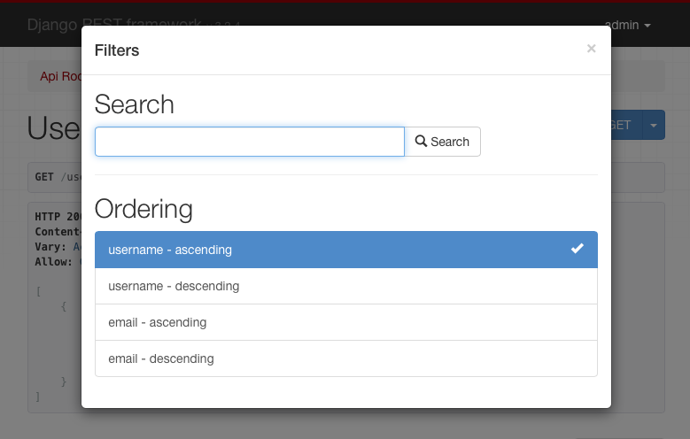

# Django REST framework 3.3

The 3.3 release marks the final work in the Kickstarter funded series. We'd like to offer a final resounding **thank you** to all our wonderful sponsors and supporters.

The amount of work that has been achieved as a direct result of the funding is immense. We've added a huge amounts of new functionality, resolved nearly 2,000 tickets, and redesigned & refined large parts of the project.

In order to continue driving REST framework forward, we're introducing [monthly paid plans](https://fund.django-rest-framework.org/topics/funding). These plans include various sponsorship rewards, and will ensure that the project remains sustainable and well supported.

We strongly believe that collaboratively funded software development yields outstanding results for a relatively low investment-per-head. If you or your company use REST framework commercially, then we would strongly urge you to participate in this latest funding drive, and help us continue to build an increasingly polished & professional product.

---

## Release notes

Significant new functionality in the 3.3 release includes:

* Filters presented as HTML controls in the browsable API.
* A [forms API][forms-api], allowing serializers to be rendered as HTML forms.
* Django 1.9 support.
* A [`JSONField` serializer field][jsonfield], corresponding to Django 1.9's Postgres `JSONField` model field.
* Browsable API support [via AJAX][ajax-form], rather than server side request overloading.

*Example of the new filter controls*

---

## Supported versions

This release drops support for Django 1.5 and 1.6. Django 1.7, 1.8 or 1.9 are now required.

This brings our supported versions into line with Django's [currently supported versions][django-supported-versions]

## Deprecations

The AJAX based support for the browsable API means that there are a number of internal cleanups in the `request` class. For the vast majority of developers this should largely remain transparent:

* To support form based `PUT` and `DELETE`, or to support form content types such as JSON, you should now use the [AJAX forms][ajax-form] javascript library. This replaces the previous 'method and content type overloading' that required significant internal complexity to the request class.
* The `accept` query parameter is no longer supported by the default content negotiation class. If you require it then you'll need to [use a custom content negotiation class](browser-enhancements.md#url-based-accept-headers).
*  The custom `HTTP_X_HTTP_METHOD_OVERRIDE` header is no longer supported by default. If you require it then you'll need to [use custom middleware](browser-enhancements.md#http-header-based-method-overriding).

The following pagination view attributes and settings have been moved into attributes on the pagination class since 3.1. Their usage was formerly deprecated, and has now been removed entirely, in line with the deprecation policy.

* `view.paginate_by` - Use `paginator.page_size` instead.
* `view.page_query_param` - Use `paginator.page_query_param` instead.
* `view.paginate_by_param` - Use `paginator.page_size_query_param` instead.
* `view.max_paginate_by` - Use `paginator.max_page_size` instead.
* `settings.PAGINATE_BY` - Use `paginator.page_size` instead.
* `settings.PAGINATE_BY_PARAM` - Use `paginator.page_size_query_param` instead.
* `settings.MAX_PAGINATE_BY` - Use `paginator.max_page_size` instead.

The `ModelSerializer` and `HyperlinkedModelSerializer` classes should now include either a `fields` or `exclude` option, although the `fields = '__all__'` shortcut may be used. Failing to include either of these two options is currently pending deprecation, and will be removed entirely in the 3.5 release. This behavior brings `ModelSerializer` more closely in line with Django's `ModelForm` behavior.

[forms-api]: html-and-forms.md
[ajax-form]: https://github.com/tomchristie/ajax-form
[jsonfield]: ../../api-guide/fields#jsonfield
[django-supported-versions]: https://www.djangoproject.com/download/#supported-versions