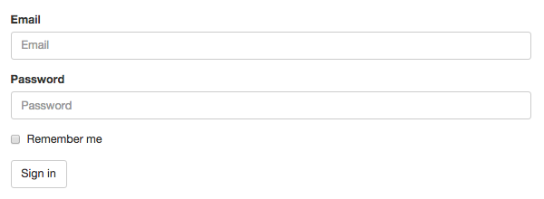

# HTML & Forms

REST framework is suitable for returning both API style responses, and regular HTML pages. Additionally, serializers can used as HTML forms and rendered in templates.

## Rendering HTML

In order to return HTML responses you'll need to either `TemplateHTMLRenderer`, or `StaticHTMLRenderer`.

The `TemplateHTMLRenderer` class expects the response to contain a dictionary of context data, and renders an HTML page based on a template that must be specified either in the view or on the response.

The `StaticHTMLRender` class expects the response to contain a string of the pre-rendered HTML content.

Because static HTML pages typically have different behavior from API responses you'll probably need to write any HTML views explicitly, rather than relying on the built-in generic views.

Here's an example of a view that returns a list of "Profile" instances, rendered in an HTML template:

**views.py**:

    from my_project.example.models import Profile
    from rest_framework.renderers import TemplateHTMLRenderer
    from rest_framework.response import Response
    from rest_framework.views import APIView

    class ProfileList(APIView):
        renderer_classes = [TemplateHTMLRenderer]
        template_name = 'profile_list.html'

        def get(self, request):
            queryset = Profile.objects.all()
            return Response({'profiles': queryset})

**profile_list.html**:

    <html><body>
    <h1>Profiles</h1>
    <ul>
        
        <li>{{ profile.name }}</li>
        
    </ul>
    </body></html>
    
## Rendering Forms

Serializers may be rendered as forms by using the `render_form` template tag, and including the serializer instance as context to the template.

The following view demonstrates an example of using a serializer in a template for viewing and updating a model instance:

**views.py**:

    from django.shortcuts import get_object_or_404
    from my_project.example.models import Profile
    from rest_framework.renderers import TemplateHTMLRenderer
    from rest_framework.views import APIView

    class ProfileDetail(APIView):
        renderer_classes = [TemplateHTMLRenderer]
        template_name = 'profile_detail.html'

        def get(self, request, pk):
            profile = get_object_or_404(Profile, pk=pk)
            serializer = ProfileSerializer(profile)
            return Response({'serializer': serializer, 'profile': profile})

        def post(self, request, pk):
            profile = get_object_or_404(Profile, pk=pk)
            serializer = ProfileSerializer(profile)
            if not serializer.is_valid():
                return Response({'serializer': serializer, 'profile': profile})
            return redirect('profile-list')

**profile_detail.html**:

    

    <html><body>
    
    <h1>Profile - {{ profile.name }}</h1>

    <form action="" method="POST">
        
        
        <input type="submit" value="Save">
    </form>

    </body></html>

### Using template packs

The `render_form` tag takes an optional `template_pack` argument, that specifies which template directory should be used for rendering the form and form fields.

REST framework includes three built-in template packs, all based on Bootstrap 3. The built-in styles are `horizontal`, `vertical`, and `inline`. The default style is `horizontal`. To use any of these template packs you'll want to also include the Bootstrap 3 CSS.

The following HTML will link to a CDN hosted version of the Bootstrap 3 CSS:

    <head>
        …
        <link rel="stylesheet" href="https://maxcdn.bootstrapcdn.com/bootstrap/3.3.5/css/bootstrap.min.css">
    </head>

Third party packages may include alternate template packs, by bundling a template directory containing the necessary form and field templates.

Let's take a look at how to render each of the three available template packs. For these examples we'll use a single serializer class to present a "Login" form.

    class LoginSerializer(serializers.Serializer):
        email = serializers.EmailField(
            max_length=100,
            style={'placeholder': 'Email'}
        )
        password = serializers.CharField(
            max_length=100,
            style={'input_type': 'password', 'placeholder': 'Password'}
        )
        remember_me = serializers.BooleanField()

---

#### `rest_framework/vertical`

Presents form labels above their corresponding control inputs, using the standard Bootstrap layout.

*This is the default template pack.*

    

    ...

    <form action="" method="post" novalidate>
        
        
        <button type="submit" class="btn btn-default">Sign in</button>
    </form>

---

#### `rest_framework/horizontal`

Presents labels and controls alongside each other, using a 2/10 column split.

*This is the form style used in the browsable API and admin renderers.*

    

    ...

    <form class="form-horizontal" action="" method="post" novalidate>
        
        
        

            

                <button type="submit" class="btn btn-default">Sign in</button>
            

        

    </form>

---

#### `rest_framework/inline`

A compact form style that presents all the controls inline.

    

    ...

    <form class="form-inline" action="" method="post" novalidate>
        
        
        <button type="submit" class="btn btn-default">Sign in</button>
    </form>

## Field styles

Serializer fields can have their rendering style customized by using the `style` keyword argument. This argument is a dictionary of options that control the template and layout used.

The most common way to customize the field style is to use the `base_template` style keyword argument to select which template in the template pack should be use.

For example, to render a `CharField` as an HTML textarea rather than the default HTML input, you would use something like this:

    details = serializers.CharField(
        max_length=1000,
        style={'base_template': 'textarea.html'}
    )

If you instead want a field to be rendered using a custom template that is *not part of an included template pack*, you can instead use the `template` style option, to fully specify a template name:

    details = serializers.CharField(
        max_length=1000,
        style={'template': 'my-field-templates/custom-input.html'}
    )

Field templates can also use additional style properties, depending on their type. For example, the `textarea.html` template also accepts a `rows` property that can be used to affect the sizing of the control.

    details = serializers.CharField(
        max_length=1000,
        style={'base_template': 'textarea.html', 'rows': 10}
    )

The complete list of `base_template` options and their associated style options is listed below.

base_template  | Valid field types  | Additional style options     
----|----|----
input.html     | Any string, numeric or date/time field | input_type, placeholder, hide_label
textarea.html |  `CharField` | rows, placeholder, hide_label
select.html | `ChoiceField` or relational field types | hide_label
radio.html | `ChoiceField` or relational field types | inline, hide_label
select_multiple.html | `MultipleChoiceField` or relational fields with `many=True` | hide_label
checkbox_multiple.html | `MultipleChoiceField` or relational fields with `many=True` | inline, hide_label
checkbox.html | `BooleanField` | hide_label
fieldset.html | Nested serializer | hide_label
list_fieldset.html | `ListField` or nested serializer with `many=True` |   hide_label
